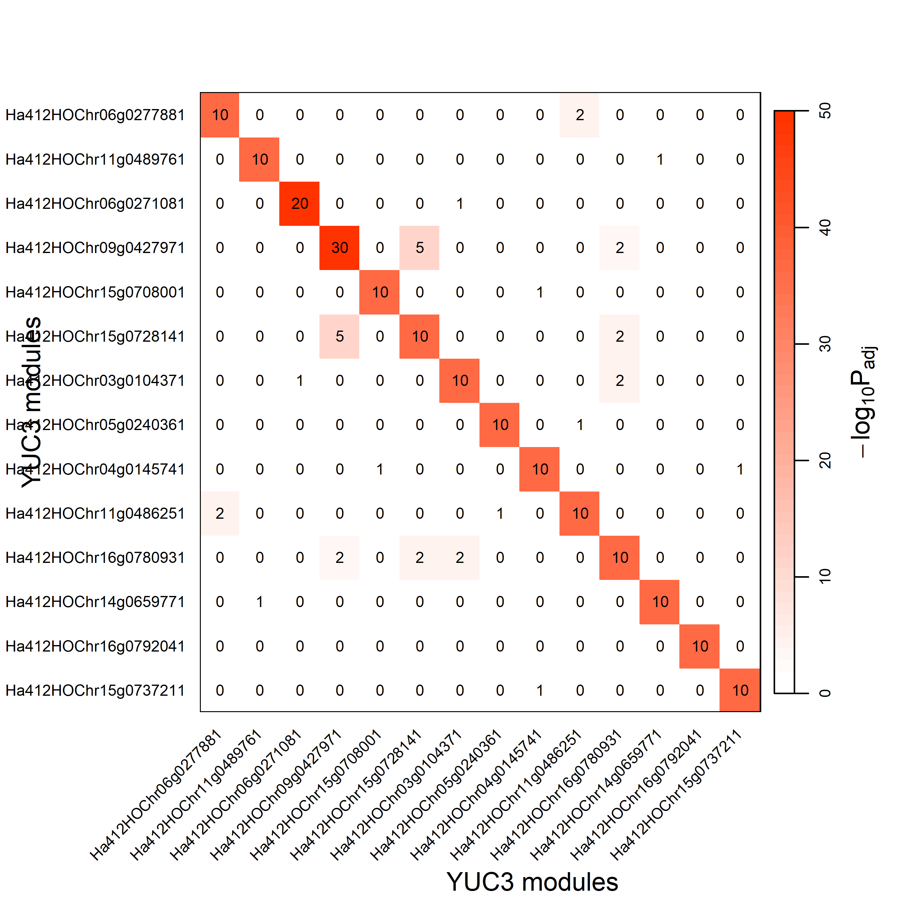
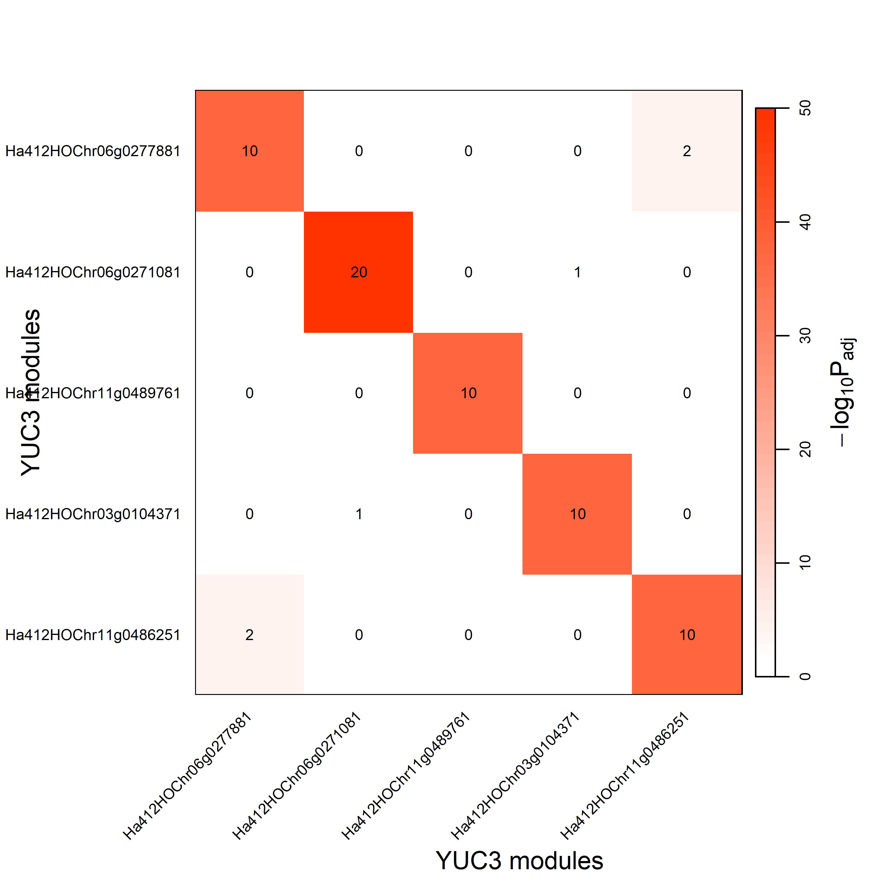

```{r setup, include=FALSE}
knitr::opts_chunk$set(echo = TRUE)
```

```{r}
# BiocManager::install(c("AnnotationDBi", "GO.db", "preprocessCore", "impute", "rrvgo", "ComplexHeatmap"))
# BiocManager::install(c("sva", "GOSim"))
# remotes::install_local("~/Downloads/GOSim_1.40.0.tgz") # get download link from https://bioconductor.org/packages/3.18/bioc/html/GOSim.html
# remotes::install_github('juanbot/CoExpNets') 
# remotes::install_github("aliciagp/TGCN")
```


Try using a [Targetted Gene Correlation Network](https://www.nature.com/articles/s41598-024-67329-7) to identify the YUC3, YUC7 and TAR2 networks


use Julin's modified version of TGCN
```{r}
# remotes::install_local("~/git/TGCN/", force = TRUE)
# or from web:
remotes::install_github("https://github.com/jnmaloof/TGCN", ref = "dev")
```


```{r}
library(TGCN)
library(tidyverse)
library(ggpubr)
library(gridExtra)
library(ggplot2)
library(here)
```

# 1. load data
```{r}
sample.description <- read.csv("./input/edgeR_key_labelSwapped.csv")
head(sample.description)
```


load read counts. These should be log2 cpm or Voom transformed or something similar.
I'll try first with anther in cond16, so load log2cpm of anther in cond16 only.

```{r}
lcpm.anther = read.csv("./input/anther_cond16_cpmLog_filterByExpr_20241022.csv", row.names = 1, check.names = FALSE) %>% 
  column_to_rownames(var = "geneID")

head(lcpm.anther)
dim(lcpm.anther) 
# View(lcpm.anther)
```
Get the GO info and convert to a list.


```{r}
GOs = read.csv("./input/ha412.xrq.GO.arab.corresponding.20250327LLW.csv")
GOs.anther = GOs[match(rownames(lcpm.anther), GOs$ha412),] %>% drop_na(ha412) 
gene2GO.list = GOs.anther %>% 
  dplyr::select(ha412, GO) %>%
  rowwise() %>%
  mutate(GOlist = str_split(GO, pattern = ";")) %>%
  ungroup() %>%
  mutate(GOlist = set_names(GOlist, ha412)) %>%
  pull(GOlist) 
```

Looking at the example notebook on the github site, it looks like genes in rows, samples in columns

My genes of interest:
  Ha412HOChr02g0091401 = HanXRQr2_Chr02g0086021 (YUC3-like);
  Ha412HOChr09g0422771 = HanXRQr2_Chr09g0410731 (TAR2-like);
  Ha412HOChr14g0654181 = HanXRQr2_Chr14g0633541 (YUC7-like)

```{r}
# my gene of interest
YUC3 = "Ha412HOChr02g0091401"
YUC7 = "Ha412HOChr14g0654181"
TAR2 = "Ha412HOChr09g0422771"
```

Subset data to build YUC3, YUC7 and TAR2 networks.  Want to find networks around expression of them, so pull those out and also create matrices that don't have them.
```{r}
# yuc3
yuc3.expression = lcpm.anther[str_detect(rownames(lcpm.anther), YUC3),] %>%
  unlist() %>%
  as.vector()
input_for_yuc3 = lcpm.anther[str_detect(rownames(lcpm.anther), YUC3, negate = TRUE),] 

# yuc7
yuc7.expression = lcpm.anther[str_detect(rownames(lcpm.anther), YUC7),] %>%
  unlist() %>%
  as.vector()
input_for_yuc7 = lcpm.anther[str_detect(rownames(lcpm.anther), YUC7, negate = TRUE),]

# TAR2
tar2.expression = lcpm.anther[str_detect(rownames(lcpm.anther), TAR2),] %>%
  unlist() %>%
  as.vector()
input_for_tar2 = lcpm.anther[str_detect(rownames(lcpm.anther), TAR2, negate = TRUE),]
```

# 2.YUC3 network
```{r, message=FALSE}
if(dir.exists("./output_enri/TGCN_YUC3"))   system("rm -r ./output_enri/TGCN_YUC3")

if(!dir.exists("./output_enri/TGCN_YUC3"))  dir.create("./output_enri/TGCN_YUC3")

r.yuc3 = testAllCutoffs(exprData=input_for_yuc3,
                    target=yuc3.expression,
                    covs=NULL,
                    train.split=0.7,
                    nfolds=5,
                    t=10,
                    path="./output_enri/TGCN_YUC3",
                    targetName="YUC3",
                    tissueName="anther",
                    seed=3333,
                    cutoffs=10:1,
                    n=100, 
                    m=10, 
                    s=10, 
                    minCor=0.3,
                    maxTol=3,
                    save=T,
                    overwrite=T,
                    approach="enrichment", # the approach selected to complete the seed modules
                    report=F,              # if report=T, an automated report will be created
                    gene2GO=gene2GO.list,
                    cellTypeAnnotation=FALSE)
```

## 2.1 cutoff selection
```{r fig.width=6,fig.height=6}
grid.arrange(r.yuc3$selectRatio$nHubs, r.yuc3$selectRatio$stats + theme(legend.position="bottom"))
# number of seeds = number of hubs (nHubs)
```

Julin focused on 5 and 6, *why focus on 5 and 6?*

I choosed 4 and 5 to continue investigating...

```{r fig.width=6}
p <- lapply(r.yuc3$nets, function(cutoff) cutoff$GOenrich$plotStats) 
ggarrange(p$c4 + theme(text=element_text(size=10)), 
          p$c5 + theme(text=element_text(size=10)),
          ncol=2, nrow=1, common.legend=T, legend="bottom")
```

## 2.2 Module size selection

```{r}
r.yuc3$nets$c4$net$moduleSizeSelectionPlot
```

```{r}
r.yuc3$nets$c5$net$moduleSizeSelectionPlot
```


## 2.3 Modules Correlation
```{r}
r.yuc3$nets$c4$net$plotCorr + labs(title = "c4")
```

```{r}
r.yuc3$nets$c5$net$plotCorr + labs(title = "c5")
```


```{r}
DT::datatable(r.yuc3$nets$c3$net$modules)
```

```{r}
DT::datatable(r.yuc3$nets$c5$net$modules)
```


```{r}

```


```{r}

```

```{r}
grid.arrange(r.yuc3$nets$c4$GOenrich$plotStats, r.yuc3$nets$c4$GOenrich$plotNterms, nrow=1)
```

```{r}
grid.arrange(r.yuc3$nets$c5$GOenrich$plotStats, r.yuc3$nets$c5$GOenrich$plotNterms, nrow=1)
```

```{r}
DT::datatable(r.yuc3$nets$c5$GOenrich$terms)
```


```{r}
DT::datatable(r.yuc3$nets$c3$GOenrich$terms)
```


